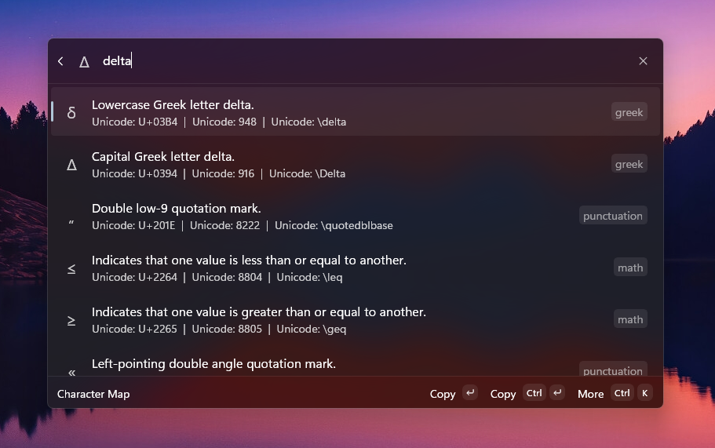

# `Character Map` Extension for Command Palette

A Command Palette extension that provides a searchable character map. It allows users to quickly find and copy special characters, symbols, and emojis.



## 🌟 Features

- Fuzzy search for characters by description, Unicode, decimal, LaTeX, and keywords.
- Copy character symbol to clipboard by pressing <kbd>Enter</kbd>.
- Context menu with options to copy character codes (Unicode, Decimal, LaTeX) to the clipboard.
- Keyboard shortcuts for copying character codes:
    - <kbd>Ctrl</kbd> + <kbd>U</kbd> for Unicode
    - <kbd>Ctrl</kbd> + <kbd>D</kbd> for Decimal
    - <kbd>Ctrl</kbd> + <kbd>L</kbd> for LaTeX
- Extensible: Add new characters by creating your own JSON files.

---

## 📖 How to Use

1. Open Command Palette.
2. Type `Character Map` to open the character map page.
3. Search for a character by its name, code, or keyword.
4. Press <kbd>Enter</kbd> on the desired character to copy the symbol to the clipboard.
5. Use the context menu or the keyboard shortcuts to copy other formats.

## ©️ Adding Characters

The character data is loaded from `.json` files in the `%LOCALAPPDATA%\CharacterMap` directory. You can add your own characters by creating new JSON files in this folder.

Each JSON file must contain a dictionary of character objects, where the key is a unique name for the character.

**Example `my-characters.json`:**

```json
{
  "delta": {
    "symbol": "Δ",
    "description": "Delta",
    "category": "Greek",
    "unicode": "U+0394",
    "decimal": "&#916;",
    "latex": "\\Delta",
    "keywords": ["delta", "greek"]
  },
  "pi": {
    "symbol": "π",
    "description": "Pi",
    "category": "Greek",
    "unicode": "U+03C0",
    "decimal": "&#960;",
    "latex": "\\pi",
    "keywords": ["pi", "greek", "math"]
  }
}
```

---

## License

This project is licensed under the MIT License. See the [LICENSE.txt](./LICENSE) file for details.
